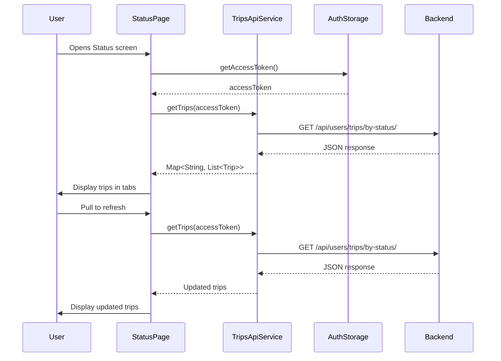

# Design Document: Status Screen Feature

## Overview

This design implements a full-featured Status screen that displays user trips grouped by status (Ongoing, Completed, Pending). The screen replaces the current blank placeholder in the Dashboard with a tabbed interface that fetches trip data from the backend API and displays detailed trip cards.

The implementation follows the app's existing architecture patterns, using a feature-based structure with dedicated view, model, and service layers. The Status screen provides pull-to-refresh functionality, proper loading and error states, and formatted trip information for easy user comprehension.

### Key Features

- Tabbed interface with three status categories (Ongoing, Completed, Pending)
- Real-time trip data fetching from backend API
- Detailed trip cards with route, vehicle, and timing information
- Pull-to-refresh support on all tabs
- Comprehensive error handling with retry capability
- Empty state messaging for tabs with no trips
- Navigation integration with existing Dashboard

## Architecture

### Component Structure

```
lib/
├── features/
│   └── status/
│       └── view/
│           └── status_page.dart (NEW)
│               ├── StatusPage (StatefulWidget)
│               ├── _StatusPageState
│               ├── _TripCard (Widget)
│               ├── _EmptyState (Widget)
│               └── _ErrorState (Widget)
├── core/
│   ├── models/
│   │   └── trip.dart (NEW)
│   │       └── Trip (Model class)
│   └── services/
│       └── trips_api_service.dart (NEW)
│           ├── TripsApiService
│           └── TripsApiException
└── features/
    └── dashboard/
        └── view/
            └── dashboard_page.dart (MODIFIED)
                └── _StatusScreen (updated to navigate)
```

### Data Flow



### State Management

The StatusPage uses local state management with StatefulWidget:

- **Loading State**: Displayed during initial fetch and refresh operations
- **Success State**: Displays trip cards grouped by status in tabs
- **Error State**: Shows error message with retry button
- **Empty State**: Displays when a tab has no trips

State transitions:
```
Initial → Loading → Success/Error
Success → Loading (refresh) → Success/Error
Error → Loading (retry) → Success/Error
```

## Components and Interfaces

### StatusPage Widget

**File:** `lib/features/status/view/status_page.dart`

**Type:** StatefulWidget

**Responsibilities:**
- Fetch trips from API on initialization
- Manage tab navigation (Ongoing, Completed, Pending)
- Handle pull-to-refresh for each tab
- Display loading, error, and empty states
- Render trip cards for each status category

**State Variables:**
```dart
bool _isLoading
String? _errorMessage
List<Trip> _ongoingTrips
List<Trip> _completedTrips
List<Trip> _pendingTrips
```

**Key Methods:**
```dart
Future<void> _fetchTrips()
Future<void> _refreshTrips()
Widget _buildTabContent(List<Trip> trips, String status)
```

### Trip Card Widget

**Component:** `_TripCard`

**Type:** StatelessWidget

**Props:**
```dart
final Trip trip
```

**Display Elements:**
- Truck icon (left side)
- Route display: "CityA → CityB"
- Status badge (e.g., "Accepted", "Ongoing")
- Vehicle size (e.g., "15 Ton")
- Pickup time (formatted: "Today 2:30 PM")
- Location details
- Chevron right icon (navigation)
- Checkmark icon (completed trips only)

**Styling:**
- White background
- Rounded corners (14px radius)
- Consistent padding (16px)
- Shadow for depth

### Empty State Widget

**Component:** `_EmptyState`

**Type:** StatelessWidget

**Props:**
```dart
final String status
```

**Display:**
- Truck icon (gray, 64px)
- Message: "No [status] trips"
- Centered layout
- Gray color scheme

### Error State Widget

**Component:** `_ErrorState`

**Type:** StatelessWidget

**Props:**
```dart
final String errorMessage
final VoidCallback onRetry
```

**Display:**
- Error icon (red, 48px)
- Error message text
- "Retry" button
- Maintains tab navigation

## Data Models

### Trip Model

**File:** `lib/core/models/trip.dart`

```dart
class Trip {
  const Trip({
    required this.id,
    required this.pickupLocation,
    required this.dropLocation,
    required this.loadSize,
    required this.loadType,
    required this.vehicleSize,
    required this.bodyType,
    required this.tripStatus,
    required this.amount,
    required this.pickupTime,
    required this.name,
    required this.contactNumber,
    required this.acceptedDrivers,
  });

  final String id;
  final String pickupLocation;
  final String dropLocation;
  final String loadSize;
  final String loadType;
  final String vehicleSize;
  final String bodyType;
  final String tripStatus;
  final String amount;
  final DateTime pickupTime;
  final String name;
  final String contactNumber;
  final List<dynamic> acceptedDrivers;

  factory Trip.fromJson(Map<String, dynamic> json) {
    return Trip(
      id: json['id'] as String,
      pickupLocation: json['pickup_location'] as String,
      dropLocation: json['drop_location'] as String,
      loadSize: json['load_size'] as String,
      loadType: json['load_type'] as String,
      vehicleSize: json['vehicle_size'] as String,
      bodyType: json['body_type'] as String,
      tripStatus: json['trip_status'] as String,
      amount: json['amount'] as String,
      pickupTime: DateTime.parse(json['pickup_time'] as String),
      name: json['name'] as String,
      contactNumber: json['contact_number'] as String,
      acceptedDrivers: json['accepted_drivers'] as List<dynamic>? ?? [],
    );
  }

  Map<String, dynamic> toJson() {
    return {
      'id': id,
      'pickup_location': pickupLocation,
      'drop_location': dropLocation,
      'load_size': loadSize,
      'load_type': loadType,
      'vehicle_size': vehicleSize,
      'body_type': bodyType,
      'trip_status': tripStatus,
      'amount': amount,
      'pickup_time': pickupTime.toIso8601String(),
      'name': name,
      'contact_number': contactNumber,
      'accepted_drivers': acceptedDrivers,
    };
  }
}
```

**Field Descriptions:**
- `id`: Unique trip identifier
- `pickupLocation`: Full pickup address
- `dropLocation`: Full drop-off address
- `loadSize`: Size of the load (e.g., "5 Ton")
- `loadType`: Type of goods being transported
- `vehicleSize`: Required vehicle size (e.g., "15 Ton")
- `bodyType`: Vehicle body type (e.g., "Open", "Closed")
- `tripStatus`: Current status ("pending", "ongoing", "completed")
- `amount`: Trip cost/fare
- `pickupTime`: Scheduled pickup datetime (ISO 8601 format)
- `name`: Customer name
- `contactNumber`: Customer phone number
- `acceptedDrivers`: List of drivers who accepted the trip

## API Service Design

### TripsApiService

**File:** `lib/core/services/trips_api_service.dart`

**Pattern:** Follows AcceptedDriversApiService pattern

**Endpoint:** `GET https://lorry.workwista.com/api/users/trips/by-status/`

**Request Headers:**
```dart
{
  'Accept': 'application/json',
  'Authorization': 'Bearer {accessToken}'
}
```

**Timeout:** 20 seconds

**Response Structure:**
```json
{
  "message": "Trips retrieved successfully",
  "data": {
    "pending": {
      "count": 2,
      "trips": [...]
    },
    "ongoing": {
      "count": 1,
      "trips": [...]
    },
    "completed": {
      "count": 5,
      "trips": [...]
    }
  }
}
```

**Method Signature:**
```dart
Future<Map<String, List<Trip>>> getTrips({
  required String? accessToken,
})
```

**Return Value:**
```dart
{
  'pending': List<Trip>,
  'ongoing': List<Trip>,
  'completed': List<Trip>
}
```

**Error Handling:**
- **401 Unauthorized**: Throws `TripsApiException` with authentication message
- **500 Server Error**: Throws `TripsApiException` with server error message
- **Timeout**: Throws `TripsApiException` with timeout message
- **Network Error**: Throws `TripsApiException` with network error message
- **Invalid JSON**: Throws `TripsApiException` with parse error message
- **Missing Fields**: Returns empty list for missing trips arrays

**Exception Class:**
```dart
class TripsApiException implements Exception {
  TripsApiException(this.message);
  final String message;
  
  @override
  String toString() => message;
}
```

### Parsing Logic

```dart
Map<String, List<Trip>> _parseTripsResponse(String source) {
  final decoded = jsonDecode(source);
  final data = decoded['data'] as Map<String, dynamic>;
  
  return {
    'pending': _parseStatusTrips(data['pending']),
    'ongoing': _parseStatusTrips(data['ongoing']),
    'completed': _parseStatusTrips(data['completed']),
  };
}

List<Trip> _parseStatusTrips(dynamic statusData) {
  if (statusData == null) return [];
  
  final trips = statusData['trips'];
  if (trips == null || trips is! List) return [];
  
  return trips
      .map((json) => Trip.fromJson(json as Map<String, dynamic>))
      .toList();
}
```

## UI Implementation Details

### Tab Bar Configuration

**Tab Controller:** DefaultTabController with length 3

**Tab Labels:**
1. "Ongoing"
2. "Completed"
3. "Pending"

**Tab Styling:**
- Selected: White background, border outline, dark text
- Unselected: Gray background (0xFFEEEEEE), gray text
- Indicator: Rounded rectangle
- Label style: 14px, font weight 600

### Trip Card Layout

```
┌─────────────────────────────────────────┐
│ 🚚  Azhicode → Kozhikode      [Accepted]│
│                                          │
│     15 Ton                          →   │
│     Today 2:30 PM                        │
│                                          │
│     Pickup: Azhicode, Kerala, India     │
│     Drop: Kozhikode, Kerala, India      │
└─────────────────────────────────────────┘
```

**Dimensions:**
- Card padding: 16px
- Icon size: 24px (truck), 20px (chevron)
- Border radius: 14px
- Spacing between elements: 8-12px

### Time Formatting Logic

```dart
String _formatPickupTime(DateTime pickupTime) {
  final now = DateTime.now();
  final today = DateTime(now.year, now.month, now.day);
  final tomorrow = today.add(Duration(days: 1));
  final pickupDate = DateTime(
    pickupTime.year,
    pickupTime.month,
    pickupTime.day,
  );
  
  final timeStr = DateFormat('h:mm a').format(pickupTime);
  
  if (pickupDate == today) {
    return 'Today $timeStr';
  } else if (pickupDate == tomorrow) {
    return 'Tomorrow $timeStr';
  } else {
    return DateFormat('MMM dd h:mm a').format(pickupTime);
  }
}
```

### City Name Extraction

```dart
String _extractCityName(String fullAddress) {
  return fullAddress.split(',').first.trim();
}
```

**Examples:**
- "Azhicode, Kerala, India" → "Azhicode"
- "Kozhikode" → "Kozhikode"
- "  Mumbai  , Maharashtra" → "Mumbai"

### Color Scheme

**Primary Colors:**
- Dark: `Color(0xFF111827)`
- Background: `Color(0xFFF2F2F2)`
- Card background: `Colors.white`
- Gray: `Color(0xFFEEEEEE)`
- Text gray: `Color(0xFF6B7280)`
- Light gray: `Color(0xFFD1D5DB)`

**Status Badge Colors:**
- Accepted: Green background
- Ongoing: Blue background
- Pending: Orange background
- Completed: Gray background

## Correctness Properties

*A property is a characteristic or behavior that should hold true across all valid executions of a system—essentially, a formal statement about what the system should do. Properties serve as the bridge between human-readable specifications and machine-verifiable correctness guarantees.*

### Property 1: Trip Model JSON Round Trip

*For any* valid Trip object, serializing to JSON with `toJson()` and then deserializing with `fromJson()` should produce an equivalent Trip object with all fields preserved.

**Validates: Requirements 3.15, 5.1, 5.4**

### Property 2: Status Filtering Correctness

*For any* list of trips and any status value ("pending", "ongoing", or "completed"), filtering the trips by that status should return only trips where `trip.tripStatus` equals the filter status.

**Validates: Requirements 6.5, 6.6, 6.7**

### Property 3: Trip Card Contains Required Information

*For any* Trip object, rendering it as a TripCard should produce a widget tree that contains the route (pickup → drop), vehicle size, status badge, and pickup time.

**Validates: Requirements 7.3, 7.4, 7.5, 7.9**

### Property 4: City Name Extraction Preserves First Segment

*For any* address string containing commas, extracting the city name should return the trimmed first segment before the first comma.

**Validates: Requirements 13.1, 13.2, 13.3**

### Property 5: Time Formatting Uses 12-Hour Clock

*For any* DateTime value, formatting it for display should produce a string containing "AM" or "PM" (12-hour clock format).

**Validates: Requirements 12.4, 12.5**

## Error Handling

### API Error Scenarios

**Authentication Failure (401):**
```dart
throw TripsApiException(
  'Authentication failed. Please log in again.',
);
```
- Display error state with message
- Provide retry button
- Consider redirecting to login if retry fails

**Server Error (500):**
```dart
throw TripsApiException(
  'Server error. Please try again later.',
);
```
- Display error state with message
- Provide retry button
- Log error for debugging

**Network Timeout:**
```dart
throw TripsApiException(
  'Request timed out. Please check your internet connection.',
);
```
- Display error state with message
- Provide retry button
- Suggest checking network connection

**Network Error:**
```dart
throw TripsApiException(
  'Network error. Please check your internet connection.',
);
```
- Display error state with message
- Provide retry button

**Parse Error:**
```dart
throw TripsApiException(
  'Failed to parse response: ${e.message}',
);
```
- Display error state with message
- Provide retry button
- Log error for debugging

### UI Error Handling

**Empty State:**
- Displayed when a tab has zero trips
- Shows friendly message: "No [status] trips"
- Uses gray color scheme
- No action required from user

**Error State:**
- Displayed when API call fails
- Shows error icon and message
- Provides "Retry" button
- Preserves tab navigation
- Does not clear existing data on refresh failure

**Loading State:**
- Displayed during initial fetch
- Displayed during pull-to-refresh
- Shows circular progress indicator
- Prevents duplicate requests

### Edge Cases

**Null or Missing Fields:**
- `acceptedDrivers`: Defaults to empty list
- `trips` array: Returns empty list if null/missing
- Status objects: Returns empty list if null/missing

**Invalid Date Format:**
- Caught by DateTime.parse() exception
- Wrapped in TripsApiException
- Displayed in error state

**Empty Response:**
- Valid scenario, not an error
- Displays empty state for all tabs

## Testing Strategy

### Dual Testing Approach

This feature requires both unit tests and property-based tests for comprehensive coverage:

**Unit Tests:** Verify specific examples, edge cases, error conditions, and UI configurations
**Property Tests:** Verify universal properties across all inputs using randomized data

### Property-Based Testing

**Library:** `dart_check` package for Dart property-based testing

**Configuration:** Minimum 100 iterations per property test

**Property Tests:**

1. **Trip Model JSON Round Trip**
   - Generate random Trip objects
   - Serialize with `toJson()` and deserialize with `fromJson()`
   - Assert all fields are preserved
   - Tag: `// Feature: status-screen, Property 1: For any valid Trip object, serializing to JSON with toJson() and then deserializing with fromJson() should produce an equivalent Trip object with all fields preserved`

2. **Status Filtering Correctness**
   - Generate random lists of trips with mixed statuses
   - Generate random status filter ("pending", "ongoing", "completed")
   - Filter trips by status
   - Assert all returned trips have the correct status
   - Tag: `// Feature: status-screen, Property 2: For any list of trips and any status value, filtering the trips by that status should return only trips where trip.tripStatus equals the filter status`

3. **Trip Card Contains Required Information**
   - Generate random Trip objects
   - Render as TripCard widget
   - Assert widget tree contains route, vehicle size, status badge, pickup time
   - Tag: `// Feature: status-screen, Property 3: For any Trip object, rendering it as a TripCard should produce a widget tree that contains the route, vehicle size, status badge, and pickup time`

4. **City Name Extraction**
   - Generate random addresses with commas
   - Extract city name
   - Assert result equals trimmed first segment
   - Tag: `// Feature: status-screen, Property 4: For any address string containing commas, extracting the city name should return the trimmed first segment before the first comma`

5. **Time Formatting Uses 12-Hour Clock**
   - Generate random DateTime values
   - Format for display
   - Assert result contains "AM" or "PM"
   - Tag: `// Feature: status-screen, Property 5: For any DateTime value, formatting it for display should produce a string containing AM or PM`

### Unit Testing

**Test Organization:**
```
test/
├── features/
│   └── status/
│       └── view/
│           └── status_page_test.dart
├── core/
│   ├── models/
│   │   └── trip_test.dart
│   └── services/
│       └── trips_api_service_test.dart
```

**Unit Test Cases:**

**TripsApiService Tests:**
- Returns correct map structure with three status keys
- Throws TripsApiException on 401 status code
- Throws TripsApiException on 500 status code
- Throws TripsApiException on timeout
- Returns empty list when trips field is null
- Returns empty list when trips field is missing
- Parses valid response correctly

**Trip Model Tests:**
- fromJson creates Trip with all fields
- toJson produces correct JSON structure
- Handles null acceptedDrivers field

**StatusPage Widget Tests:**
- Displays AppBar with "Status" title
- Uses correct background color (0xFFF2F2F2)
- Displays TabBar with three tabs in correct order
- Selected tab has white background
- Unselected tabs have gray background
- Displays loading indicator during initial fetch
- Displays trip cards after successful fetch
- Displays error state with retry button on failure
- Displays empty state when tab has no trips
- Retry button triggers new fetch
- Pull-to-refresh triggers new fetch
- Pull-to-refresh preserves tab selection
- Error during refresh shows SnackBar

**TripCard Widget Tests:**
- Displays truck icon
- Displays route in "CityA → CityB" format
- Displays status badge
- Displays vehicle size
- Displays chevron right icon
- Displays checkmark icon for completed trips
- Displays pickup time formatted correctly
- Uses white background with rounded corners
- Displays "Today" for today's pickup time
- Displays "Tomorrow" for tomorrow's pickup time
- Displays "MMM DD" for other dates

**Navigation Tests:**
- _StatusScreen navigates to StatusPage
- StatusPage displays back button
- Back button pops to Dashboard

**Empty State Tests:**
- Displays truck icon
- Displays "No [status] trips" message
- Uses gray colors
- Centered layout

**Error State Tests:**
- Displays error icon
- Displays error message text
- Displays "Retry" button
- Preserves tab navigation

### Testing Balance

- **Unit tests** handle specific examples, edge cases, and UI configuration verification
- **Property tests** handle universal behaviors across all possible inputs
- Together they provide comprehensive coverage without redundancy

### Manual Testing Checklist

- [ ] Status screen opens from Dashboard
- [ ] Three tabs display correctly
- [ ] Trips load and display in correct tabs
- [ ] Trip cards show all required information
- [ ] Pull-to-refresh works on all tabs
- [ ] Empty state displays when no trips
- [ ] Error state displays on API failure
- [ ] Retry button refetches trips
- [ ] Time formatting displays correctly
- [ ] City names extracted correctly
- [ ] Navigation back to Dashboard works
- [ ] Tab selection persists during refresh
- [ ] Loading indicators display appropriately

## Implementation Notes

### Dependencies

**Required Packages:**
- `http`: ^1.1.0 (already in project)
- `intl`: ^0.18.0 (for date formatting)
- `shared_preferences`: ^2.2.0 (already in project)

**Add to pubspec.yaml:**
```yaml
dependencies:
  intl: ^0.18.0
```

### Implementation Order

1. **Create Trip Model** (`lib/core/models/trip.dart`)
   - Define Trip class with all fields
   - Implement fromJson factory
   - Implement toJson method
   - Write unit tests

2. **Create TripsApiService** (`lib/core/services/trips_api_service.dart`)
   - Define TripsApiException
   - Implement getTrips method
   - Implement parsing logic
   - Handle all error scenarios
   - Write unit tests

3. **Create StatusPage** (`lib/features/status/view/status_page.dart`)
   - Implement StatefulWidget structure
   - Add TabBar and TabBarView
   - Implement _fetchTrips method
   - Implement _refreshTrips method
   - Add loading state
   - Add error state
   - Add empty state
   - Write widget tests

4. **Create TripCard Widget**
   - Implement card layout
   - Add time formatting logic
   - Add city extraction logic
   - Add status badge
   - Write widget tests

5. **Update Dashboard Navigation**
   - Modify _StatusScreen to navigate to StatusPage
   - Test navigation flow

6. **Write Property-Based Tests**
   - Set up dart_check package
   - Implement all 5 property tests
   - Run with 100+ iterations

### Migration Considerations

- No database migrations required
- No breaking changes to existing code
- Dashboard modification is minimal (navigation only)
- New feature is isolated in `features/status/` directory

### Performance Considerations

- **API Caching**: Consider caching trips data for 30-60 seconds to reduce API calls
- **Lazy Loading**: TabBarView only builds visible tab content
- **Const Widgets**: Use const constructors where possible
- **Image Caching**: Truck icon should be cached
- **List Performance**: Use ListView.builder for large trip lists

### Accessibility

- AppBar title is readable by screen readers
- Tab labels are descriptive
- Trip cards have semantic labels
- Error messages are announced
- Retry button is accessible
- Pull-to-refresh is accessible via semantic actions

## Conclusion

This design provides a comprehensive implementation of the Status screen feature, following the app's existing patterns and architecture. The feature includes robust error handling, proper state management, and a clean separation of concerns between UI, models, and services.

The dual testing approach (unit tests + property-based tests) ensures both specific requirements and universal behaviors are validated. The implementation is isolated in the `features/status/` directory, making it maintainable and extensible for future enhancements.
